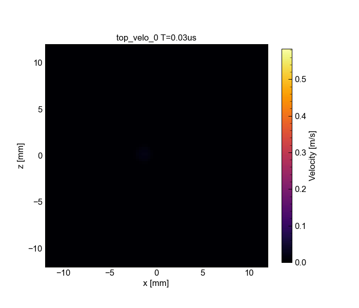

# UGUCA extended for analysis of non-self-similar earthquakes

[](https://doi.org/10.5281/zenodo.15288456)

This repository contains the extended version of the spectral-boundary-integral method-based software [**UGUCA**](https://gitlab.com/uguca/uguca) for the analysis in [**4mNonSelfSim_Paper**](https://github.com/kura-okubo/4mNonSelfSim_Paper), where we performed dynamic rupture modeling of non-self-similar earthquakes observed in laboratory experiments.

This version is forked from the `stable` branch of `v1.0` from the [UGUCA](https://gitlab.com/uguca/uguca) repository.  
See the original GitLab repository for the latest version and software information.

## Updated contents

- Linear slip-weakening law with slip-strengthening regime.
- Input files for the case study of laboratory non-self-similar earthquakes.
- Kernel for the rock specimen ($\nu$=0.246).

## Installation
Follow the [original instruction](https://gitlab.com/uguca/uguca).

### Tips
If you find an error:
```sh
-- Could NOT find MPI_CXX (missing: MPI_CXX_WORKS)
CMake Error at /usr/local/share/cmake/Modules/FindPackageHandleStandardArgs.cmake:233 (message):
  Could NOT find MPI (missing: MPI_CXX_FOUND) (found version "3.1")
```

I would recommend to install the openmpi from the source with specifying the gcc compilers ([ref1](https://stackoverflow.com/questions/9186033/using-homebrew-with-alternate-gcc), [ref2](https://qiita.com/yjmtsmt/items/07dd58761c5405ecc703)).

```sh
export HOMEBREW_CC=gcc-14 # check the gcc version
export HOMEBREW_CXX=g++-14
```

```sh
brew install gcc
brew uninstall --ignore-dependencies open-mpi
brew install open-mpi --build-from-source
```

Running `ctest` with MPI-related shell scripts may cause issues. In such cases, you can run the test scripts manually.

## Minimum working example: How to run

In the `4mNonSelfSim_UGUCA` directory, execute the following commands::
```sh
mkdir build_example
cd build_example
sh ../local_cmake_twice.sh # better to make twice
cd ./example_4mNonSelfSim
sh run_rupgougepatch_casestudy.sh
python plot_example_animation.py
```

## Input Files for Main Analysis

The following directories contain input files used in the main rupture model analysis:

- [**simulations_main_casestudy_hpc_paramsearch**](simulations_main_casestudy_hpc_paramsearch): This directory includes input files used to perform a parameter grid search for identifying the best-fit rupture model parameters. For further details, refer to the associated script: [Parameter Grid Search Script](https://github.com/kura-okubo/4mNonSelfSim_Paper/blob/dev/RuptureSimulation/main_casestudy/preprocess_modelsetup/code/02_gougepatch_dynrup_main_casestudy_hpc_paramgridsearch.py).

- [**simulations_main_casestudy_hpc_master**](simulations_main_casestudy_hpc_master): This directory contains input files configured for the best-fit parameter set. These files are used in the final simulations of the selected rupture model. Refer to the following notebook for additional information: [Best-Fit Parameter Setup](https://github.com/kura-okubo/4mNonSelfSim_Paper/blob/dev/RuptureSimulation/main_casestudy/preprocess_modelsetup/code/03_gougepatch_dynrup_main_casestudy_hpc_master.ipynb).


## Gallery


Animation: the output of miminum working example.

## Original License
```
Copyright &copy; 2021 ETH Zurich (David S. Kammer)

uguca is free software: you can redistribute it and/or modify it under the terms of the GNU Lesser General Public License as published by the Free Software Foundation, either version 3 of the License, or (at your option) any later version.

uguca is distributed in the hope that it will be useful, but WITHOUT ANY WARRANTY; without even the implied warranty of MERCHANTABILITY or FITNESS FOR A PARTICULAR PURPOSE.  See the GNU Lesser General Public License for more details.

You should have received a copy of the GNU Lesser General Public License along with uguca.  If not, see <https://www.gnu.org/licenses/>.
```
